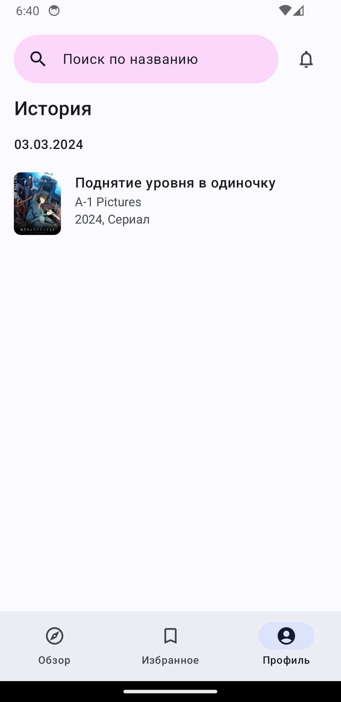

#  ShiraBox

**🏗️ Project still in early development and not suits for daily usage 🧑‍💻**

  
  
  
  
  

    <em>Save and watch your favourite animes in many voiceovers!</em>

    
    
    

## Development road 🔝

1. [x] Basic UI - ✅
2. [x] Catalog implementation - ✅
3. [x] At least one video source - ✅
4. [x] Player functionality - ✅
5. [ ] Settings backend - 🏗️
6. [ ] Notifications - 🏗️
7. [ ] Opening skips  API integration - ❌
8. [ ] User's watch statistics - ❌
9. [ ] Ranobe & Manga reading functionality - ❌

| Development status | Emoticon  |
|--------------------|-----------|
| Done               |✅        |
| Work in progress   |🏗️        |
| Planned            |❌        |

## Installation

Currently no official binaries provided.

### License

[GPL-3.0](https://github.com/urFate/shirabox-app?tab=GPL-3.0-1-ov-file)
