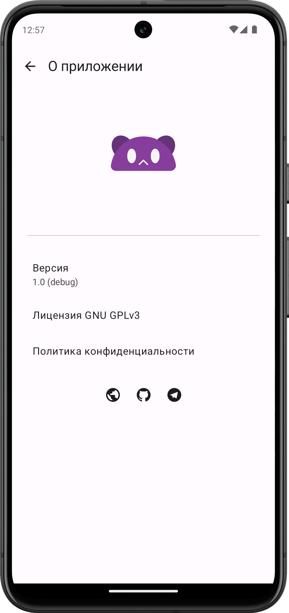

#  ShiraBox

  
  
  
  
  
  

    <em>Save and watch your favourite animes in many voiceovers!</em>

    
    
    

## Development road 🔝

1. [x] Basic UI - ✅
2. [x] Catalog implementation - ✅
3. [x] At least one video source - ✅
4. [x] Player functionality - ✅
5. [x] Settings backend - ✅
6. [x] Opening skips API integration - ✅
7. [x] Notifications - ✅
8. [ ] User data sync - ❌
9. [ ] TV Application - ❌
10. [ ] User's watch statistics - ❌
11. [ ] Ranobe & Manga reading functionality - ❌

| Development status | Emoticon  |
|--------------------|-----------|
| Done               |✅        |
| Work in progress   |🏗️        |
| Planned            |❌        |

## Installation

Downloads available on our [GitHub Releases](https://github.com/urFate/shirabox-app/releases/latest) page or on [official website](https://www.shirabox.live/).
Nightly APK builds currently available on our [Github Actions](https://github.com/urFate/shirabox-app/actions).

> [!IMPORTANT]
> Debug builds usually runs much slower than release builds and destined for development or preview purposes only.

### License

[GPL-3.0](https://github.com/urFate/shirabox-app?tab=GPL-3.0-1-ov-file)
